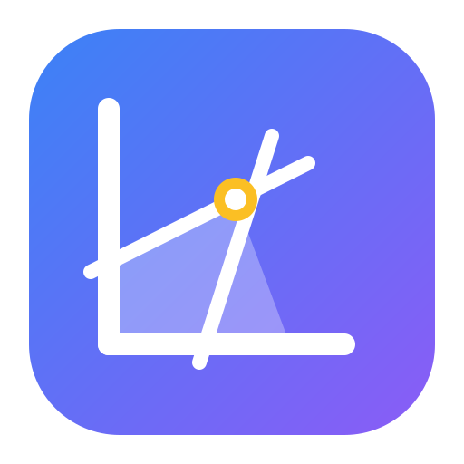

<div align="center">
  
  <h1>OptiSolver</h1>
  <p>Uma ferramenta web avançada e acessível para Resolução de Problemas de Otimização Matemática.</p>
  
  <a href="https://josebieco.github.io/opti-solver/"><strong>Acesse a aplicação ao vivo 🌐</strong></a>
</div>

<br />

## 💡 Sobre o Projeto

O **OptiSolver** nasceu com o objetivo de simplificar e democratizar o aprendizado e a resolução de problemas complexos de otimização matemática (Pesquisa Operacional). Muitas das ferramentas matemáticas disponíveis no mercado possuem interfaces arcaicas, não responsivas e de difícil utilização. 

Nossa ideia e intenção com esta plataforma é entregar uma experiência **Fluida, Moderna e Altamente Acessível**, rodando inteiramente no navegador do usuário. Você pode configurar a função objetivo, o número de variáveis, as restrições (equações ou inequações), e assistir aos métodos de otimização trabalhando iterativamente até encontrarem o Valor Ótimo ($Z$).

### Principais Funcionalidades
- **Interface Gráfica Dinâmica**: Modelagem intuitiva dos problemas direto no navegador, sem linhas de comando.
- **Gráficos Interativos**: Visualização em 2D de Regiões Factíveis e árvores de decisão.
- **Foco em Acessibilidade**: Navegação por teclado, leitores de tela e barra de acessibilidade nativa (Alto Contraste, Fontes Escaláveis e Temas de Cores).
- **Processamento Local**: Toda a resolução ocorre no lado do cliente com processamento otimizado (TypeScript), oferecendo resultados instantâneos sem sobrecarregar servidores.

---

## 🧮 Algoritmos Implementados

O motor matemático ("Solver") conta com soluções rigorosamente implementadas para abranger um grande leque de sub-áreas da programação matemática:

1. **Dual Simplex**: Utilizado para resolver problemas de Programação Linear. Trata eficazmente restrições de desigualdade, sendo crucial quando as soluções básicas perdem a viabilidade (permitindo a restauração a partir do espaço Dual).
2. **Branch and Bound**: Motor central para resolver problemas de Programação Inteira e Mista, buscando a solução através da divisão sistemática (branching) e do estabelecimento de limitantes (bounding) para podar a árvore de nós ineficientes.
3. **Branch and Cut (Cortes de Gomory)**: Um aprimoramento que injeta **Cortes Fracionários de Gomory** durante as iterações do Branch and Bound. Isso enriquece a formulação reduzindo drasticamente o tamanho do espaço de busca em problemas inteiros complexos.

---

## 📂 Estrutura de Pastas

A arquitetura do projeto segue o padrão **App Router** do Next.js:

```
opti-solver/
├── app/                  # Rotas e páginas da aplicação (Next.js App Router)
│   ├── branch-and-cut/   # Rota: Ferramenta do método Branch and Cut
│   ├── discrete/         # Rota: Ferramenta de Otimização Discreta (Branch and Bound)
│   ├── linear/           # Rota: Ferramenta de Otimização Linear (Dual Simplex)
│   ├── layout.tsx        # Layout mestre que envolve todas as páginas
│   └── page.tsx          # Página inicial / Landing Page
├── components/           # Componentes UI reutilizáveis (shadcn/ui e componentes de negócio)
│   ├── ui/               # Componentes primitivos visuais base (Botões, Cards, Inputs)
│   ├── accessibility-bar # Componente de acessibilidade e temas (Contraste, Cores, Fonte)
│   ├── math-model-form   # Formulário genérico e inteligente para montar modelos matemáticos
│   └── optimization-results # Renderizador gráfico dos resultados ótimos e iterações
├── lib/                  # Código central e lógica do sistema
│   ├── optimization/     # O "Motor Matemático" (Implementação estrita dos Algoritmos)
│   └── utils.ts          # Helpers utilitários
└── public/               # Ativos estáticos e identidade visual (Logo, SVG)
```

---

## 🛠️ Tecnologias Utilizadas

- **Framework:** [Next.js 16](https://nextjs.org/) (App Router, Turbopack)
- **Linguagem:** [TypeScript](https://www.typescriptlang.org/)
- **Estilização:** [Tailwind CSS](https://tailwindcss.com/)
- **Componentes:** [shadcn/ui](https://ui.shadcn.com/)
- **Ícones:** [Lucide React](https://lucide.dev/)

---

## 🚀 Como Executar Localmente

Siga os passos abaixo para baixar, instalar e rodar o projeto na sua máquina.

### Pré-requisitos
- Node.js (versão 18.x ou superior)
- NPM ou Yarn

### Passo a Passo

1. **Clone o repositório**
   ```bash
   git clone https://github.com/josebieco/opti-solver.git
   ```

2. **Entre na pasta do projeto**
   ```bash
   cd opti-solver
   ```

3. **Instale as dependências**
   ```bash
   npm install
   # ou
   yarn install
   ```

4. **Inicie o servidor de desenvolvimento**
   ```bash
   npm run dev
   # ou
   yarn dev
   ```

5. **Acesse no navegador**
   Abra `http://localhost:3000` para ver o sistema rodando.

---

## 👨‍💻 Autor

**José Eduardo Saroba Bieco**  
Engenheiro da Computação, Especialista em IA e Mestre em Ciências de Computação (ICMC - USP).

- 🌐 **Site Pessoal:** [josebieco.github.io](https://josebieco.github.io)
- 🎓 **Lattes:** [1790961525430099](http://lattes.cnpq.br/1790961525430099)
- 💼 **LinkedIn:** [josebieco](https://www.linkedin.com/in/josebieco)
